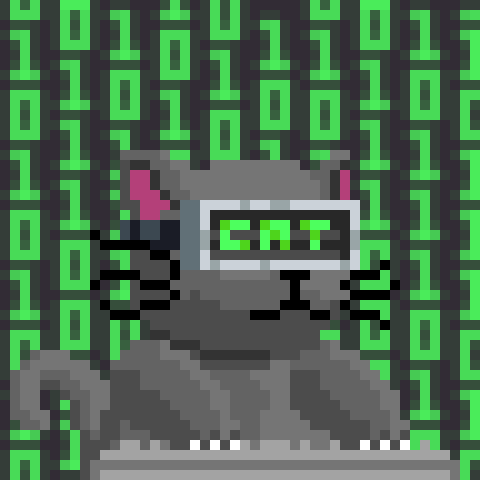

  

# 💫 About Me:

<table>
<tr>
<td width="60%">
  
### 🔭 I'm currently working on *Computer Vision and Machine Learning*.   
### 🤝 I'm looking for help with *Deep Learning for Human Attention*.   
### 🌱 I'm currently learning *Deep Learning with TensorFlow, YOLO Model,* and trying to master *OpenCV*. 
### 📫 How to reach me *asifurrahaman2019@gmail.com*

</td>
<td width="40%" align="center">

</td>
</tr>
</table>

---

# 🌐 Connect with me:

  
  

---

## 🏆 GitHub Trophies

---

# 💻 Tech Stack:
 

 
 
 
 
 
 
 
 
 
 
 
 
 
 
 
 

 
   
   
   
   
   
   
   
   
   
  

   
   
   
   
   
   
   
   
   

---

# 📊 GitHub Stats:

</table>
  <table>
    <tr>
     <td width= "25%" height= "100%">
      
     </td>
     <td width= "75%">
        
      </td>
     </tr>
    
  </table>

<!-- Contribution Graph moved below in full width -->

###

<table>
<tr>
<td width="65%">

 

</td>
<td width="35%">

</td>
</tr>
</table>

 <table>
   <td>
        
   </td>
      <td>
        
      </td>
    
  </table>

---

# 🔝 Top Contributed Repo

  
  
  

---

### ✍️ Random Dev Quote

---

###

